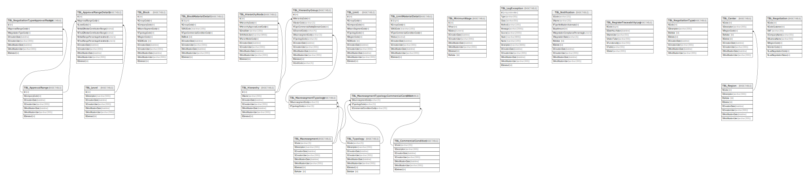

# postobon-neg-db

## Tables

| Name | Columns | Comment | Type |
| ---- | ------- | ------- | ---- |
| [TBL_ApprovalRange](TBL_ApprovalRange.md) | 7 |  | BASIC TABLE |
| [TBL_ApprovalRangeDetails](TBL_ApprovalRangeDetails.md) | 12 |  | BASIC TABLE |
| [TBL_Block](TBL_Block.md) | 12 |  | BASIC TABLE |
| [TBL_BlockMaterialDetail](TBL_BlockMaterialDetail.md) | 10 |  | BASIC TABLE |
| [TBL_Hierarchy](TBL_Hierarchy.md) | 7 |  | BASIC TABLE |
| [TBL_HierarchyGroup](TBL_HierarchyGroup.md) | 13 |  | BASIC TABLE |
| [TBL_HierarchyNode](TBL_HierarchyNode.md) | 11 |  | BASIC TABLE |
| [TBL_Level](TBL_Level.md) | 7 |  | BASIC TABLE |
| [TBL_Limit](TBL_Limit.md) | 12 |  | BASIC TABLE |
| [TBL_LimitMaterialDetail](TBL_LimitMaterialDetail.md) | 10 |  | BASIC TABLE |
| [TBL_Macrosegment](TBL_Macrosegment.md) | 8 |  | BASIC TABLE |
| [TBL_MinimunWage](TBL_MinimunWage.md) | 9 |  | BASIC TABLE |
| [TBL_NegotiationTypeApprovalRange](TBL_NegotiationTypeApprovalRange.md) | 8 |  | BASIC TABLE |
| [TBL_Typology](TBL_Typology.md) | 8 |  | BASIC TABLE |
| [TBL_LogException](TBL_LogException.md) | 14 |  | BASIC TABLE |
| [TBL_MacrosegmentTypology](TBL_MacrosegmentTypology.md) | 2 |  | BASIC TABLE |
| [TBL_CommercialCondition](TBL_CommercialCondition.md) | 7 |  | BASIC TABLE |
| [TBL_MacrosegmentTypologyCommercialCondition](TBL_MacrosegmentTypologyCommercialCondition.md) | 3 |  | BASIC TABLE |
| [TBL_Notification](TBL_Notification.md) | 12 |  | BASIC TABLE |
| [TBL_RegisterTraceabilityLog](TBL_RegisterTraceabilityLog.md) | 7 |  | BASIC TABLE |
| [TBL_NegotiationType](TBL_NegotiationType.md) | 8 |  | BASIC TABLE |
| [TBL_Region](TBL_Region.md) | 8 |  | BASIC TABLE |
| [TBL_Center](TBL_Center.md) | 9 |  | BASIC TABLE |
| [TBL_Negotiation](TBL_Negotiation.md) | 9 |  | BASIC TABLE |

## Stored procedures and functions

| Name | ReturnType | Arguments | Type |
| ---- | ------- | ------- | ---- |
| dbo.fn_diagramobjects | int |  | SQL scalar function |
| dbo.sp_alterdiagram |  | @diagramname sysname, @owner_id int, @version int, @definition varbinary | SQL Stored Procedure |
| dbo.sp_creatediagram |  | @diagramname sysname, @owner_id int, @version int, @definition varbinary | SQL Stored Procedure |
| dbo.sp_dropdiagram |  | @diagramname sysname, @owner_id int | SQL Stored Procedure |
| dbo.sp_helpdiagramdefinition |  | @diagramname sysname, @owner_id int | SQL Stored Procedure |
| dbo.sp_helpdiagrams |  | @diagramname sysname, @owner_id int | SQL Stored Procedure |
| dbo.sp_renamediagram |  | @diagramname sysname, @owner_id int, @new_diagramname sysname | SQL Stored Procedure |
| dbo.sp_upgraddiagrams |  |  | SQL Stored Procedure |

## Relations

---

> Generated by [tbls](https://github.com/k1LoW/tbls)
