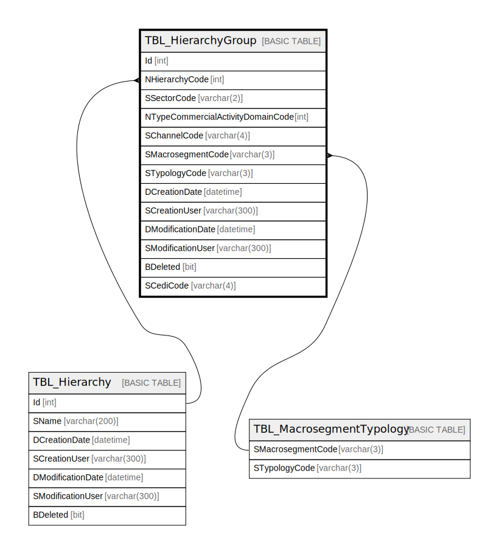

# TBL_HierarchyGroup

## Description

## Columns

| Name | Type | Default | Nullable | Children | Parents | Comment |
| ---- | ---- | ------- | -------- | -------- | ------- | ------- |
| Id | int |  | false |  |  |  |
| NHierarchyCode | int |  | false |  | [TBL_Hierarchy](TBL_Hierarchy.md) |  |
| SSectorCode | varchar(2) |  | true |  |  |  |
| NTypeCommercialActivityDomainCode | int |  | false |  |  |  |
| SChannelCode | varchar(4) |  | true |  |  |  |
| SMacrosegmentCode | varchar(3) |  | true |  | [TBL_MacrosegmentTypology](TBL_MacrosegmentTypology.md) |  |
| STypologyCode | varchar(3) |  | true |  | [TBL_MacrosegmentTypology](TBL_MacrosegmentTypology.md) |  |
| DCreationDate | datetime |  | true |  |  |  |
| SCreationUser | varchar(300) |  | true |  |  |  |
| DModificationDate | datetime |  | true |  |  |  |
| SModificationUser | varchar(300) |  | true |  |  |  |
| BDeleted | bit |  | false |  |  |  |
| SCediCode | varchar(4) |  | true |  |  |  |

## Constraints

| Name | Type | Definition |
| ---- | ---- | ---------- |
| PK_TBL_HierarchyGroup | PRIMARY KEY | CLUSTERED, unique, part of a PRIMARY KEY constraint, [ Id ] |
| IX_TBL_HierarchyGroup_Macrosegment_Typology | UNIQUE | NONCLUSTERED, unique, part of a UNIQUE constraint, [ SMacrosegmentCode, STypologyCode ] |
| FK_TBL_HierarchyGroup_TBL_Hierarchy | FOREIGN KEY | FOREIGN KEY(NHierarchyCode) REFERENCES TBL_Hierarchy(Id) ON UPDATE NO_ACTION ON DELETE NO_ACTION |
| FK_TBL_HierarchyGroup_TBL_MacrosegmentTypology | FOREIGN KEY | FOREIGN KEY(SMacrosegmentCode, STypologyCode) REFERENCES TBL_MacrosegmentTypology(SMacrosegmentCode, STypologyCode) ON UPDATE NO_ACTION ON DELETE NO_ACTION |

## Indexes

| Name | Definition |
| ---- | ---------- |
| PK_TBL_HierarchyGroup | CLUSTERED, unique, part of a PRIMARY KEY constraint, [ Id ] |
| IX_TBL_HierarchyGroup_Macrosegment_Typology | NONCLUSTERED, unique, part of a UNIQUE constraint, [ SMacrosegmentCode, STypologyCode ] |

## Relations

---

> Generated by [tbls](https://github.com/k1LoW/tbls)
