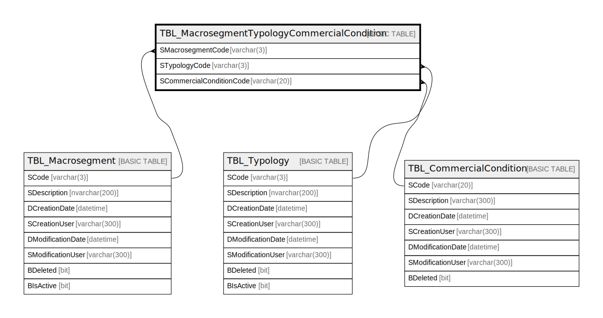

# TBL_MacrosegmentTypologyCommercialCondition

## Description

## Columns

| Name | Type | Default | Nullable | Children | Parents | Comment |
| ---- | ---- | ------- | -------- | -------- | ------- | ------- |
| SMacrosegmentCode | varchar(3) |  | false |  | [TBL_Macrosegment](TBL_Macrosegment.md) |  |
| STypologyCode | varchar(3) |  | false |  | [TBL_Typology](TBL_Typology.md) |  |
| SCommercialConditionCode | varchar(20) |  | false |  | [TBL_CommercialCondition](TBL_CommercialCondition.md) |  |

## Constraints

| Name | Type | Definition |
| ---- | ---- | ---------- |
| PK_TBL_MacrosegmentTypologyCommercialCondition | PRIMARY KEY | CLUSTERED, unique, part of a PRIMARY KEY constraint, [ SMacrosegmentCode, STypologyCode, SCommercialConditionCode ] |
| FK_TBL_MacrosegmentTypologyCommercialCondition_TBL_CommercialCondition | FOREIGN KEY | FOREIGN KEY(SCommercialConditionCode) REFERENCES TBL_CommercialCondition(SCode) ON UPDATE NO_ACTION ON DELETE NO_ACTION |
| FK_TBL_MacrosegmentTypologyCommercialCondition_TBL_Macrosegment | FOREIGN KEY | FOREIGN KEY(SMacrosegmentCode) REFERENCES TBL_Macrosegment(SCode) ON UPDATE NO_ACTION ON DELETE NO_ACTION |
| FK_TBL_MacrosegmentTypologyCommercialCondition_TBL_Typology | FOREIGN KEY | FOREIGN KEY(STypologyCode) REFERENCES TBL_Typology(SCode) ON UPDATE NO_ACTION ON DELETE NO_ACTION |

## Indexes

| Name | Definition |
| ---- | ---------- |
| PK_TBL_MacrosegmentTypologyCommercialCondition | CLUSTERED, unique, part of a PRIMARY KEY constraint, [ SMacrosegmentCode, STypologyCode, SCommercialConditionCode ] |

## Relations

---

> Generated by [tbls](https://github.com/k1LoW/tbls)
