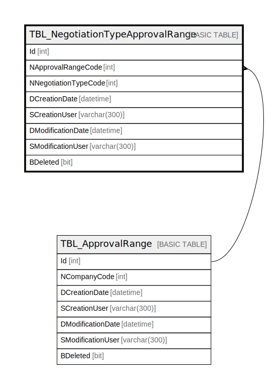

# TBL_NegotiationTypeApprovalRange

## Description

## Columns

| Name | Type | Default | Nullable | Children | Parents | Comment |
| ---- | ---- | ------- | -------- | -------- | ------- | ------- |
| Id | int |  | false |  |  |  |
| NApprovalRangeCode | int |  | false |  | [TBL_ApprovalRange](TBL_ApprovalRange.md) |  |
| NNegotiationTypeCode | int |  | false |  |  |  |
| DCreationDate | datetime |  | true |  |  |  |
| SCreationUser | varchar(300) |  | true |  |  |  |
| DModificationDate | datetime |  | true |  |  |  |
| SModificationUser | varchar(300) |  | true |  |  |  |
| BDeleted | bit |  | false |  |  |  |

## Constraints

| Name | Type | Definition |
| ---- | ---- | ---------- |
| PK_TBL_Negotiation_Type_Approval_Range | PRIMARY KEY | CLUSTERED, unique, part of a PRIMARY KEY constraint, [ Id ] |
| FK_TBL_Approval_Range_TBL_Negotiation_Type_Approval_Range | FOREIGN KEY | FOREIGN KEY(NApprovalRangeCode) REFERENCES TBL_ApprovalRange(Id) ON UPDATE NO_ACTION ON DELETE NO_ACTION |

## Indexes

| Name | Definition |
| ---- | ---------- |
| PK_TBL_Negotiation_Type_Approval_Range | CLUSTERED, unique, part of a PRIMARY KEY constraint, [ Id ] |

## Relations

---

> Generated by [tbls](https://github.com/k1LoW/tbls)
