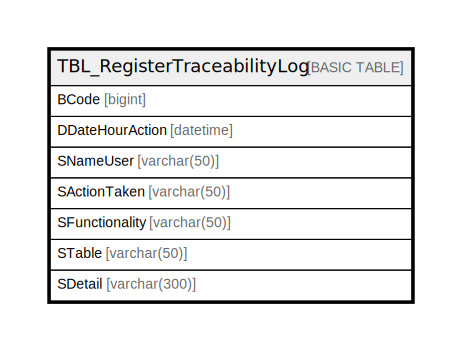

# TBL_RegisterTraceabilityLog

## Description

## Columns

| Name | Type | Default | Nullable | Children | Parents | Comment |
| ---- | ---- | ------- | -------- | -------- | ------- | ------- |
| BCode | bigint |  | false |  |  |  |
| DDateHourAction | datetime |  | false |  |  |  |
| SNameUser | varchar(50) |  | false |  |  |  |
| SActionTaken | varchar(50) |  | false |  |  |  |
| SFunctionality | varchar(50) |  | false |  |  |  |
| STable | varchar(50) |  | false |  |  |  |
| SDetail | varchar(300) |  | false |  |  |  |

## Constraints

| Name | Type | Definition |
| ---- | ---- | ---------- |
| PK__TBL_Regi_* | PRIMARY KEY | CLUSTERED, unique, part of a PRIMARY KEY constraint, [ BCode ] |

## Indexes

| Name | Definition |
| ---- | ---------- |
| PK__TBL_Regi_* | CLUSTERED, unique, part of a PRIMARY KEY constraint, [ BCode ] |

## Relations

---

> Generated by [tbls](https://github.com/k1LoW/tbls)
