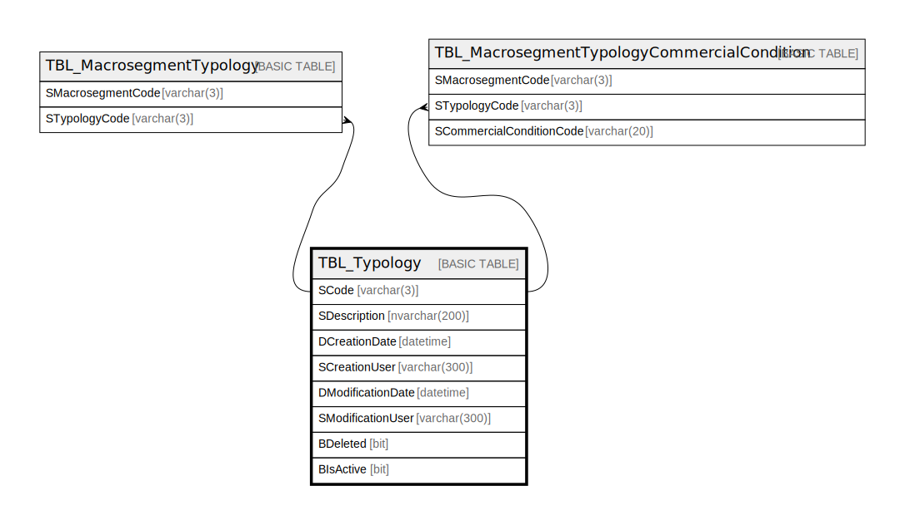

# TBL_Typology

## Description

## Columns

| Name | Type | Default | Nullable | Children | Parents | Comment |
| ---- | ---- | ------- | -------- | -------- | ------- | ------- |
| SCode | varchar(3) |  | false | [TBL_MacrosegmentTypology](TBL_MacrosegmentTypology.md) [TBL_MacrosegmentTypologyCommercialCondition](TBL_MacrosegmentTypologyCommercialCondition.md) |  |  |
| SDescription | nvarchar(200) |  | false |  |  |  |
| DCreationDate | datetime |  | false |  |  |  |
| SCreationUser | varchar(300) |  | false |  |  |  |
| DModificationDate | datetime |  | true |  |  |  |
| SModificationUser | varchar(300) |  | true |  |  |  |
| BDeleted | bit |  | false |  |  |  |
| BIsActive | bit |  | false |  |  |  |

## Constraints

| Name | Type | Definition |
| ---- | ---- | ---------- |
| PK_TBL_Typology | PRIMARY KEY | CLUSTERED, unique, part of a PRIMARY KEY constraint, [ SCode ] |

## Indexes

| Name | Definition |
| ---- | ---------- |
| PK_TBL_Typology | CLUSTERED, unique, part of a PRIMARY KEY constraint, [ SCode ] |

## Relations

---

> Generated by [tbls](https://github.com/k1LoW/tbls)
